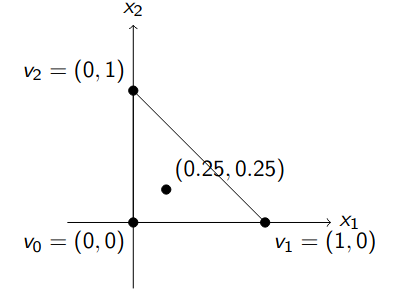

# Report: Formalization of the Edge Theorem in Lean 4

## General Picture

The goal is to prove the **Edge Theorem**, which characterizes the root location of a family of polynomials whose coefficients vary within a box. To prove it, we need two Big Lemmas (as per the book):

> **Lemma 6.1** If a real $s_r$ belongs to $R(\Omega)$, then there exists an exposed edge $E$ of $\Omega$ such that $s_r \in R(E)$, and if a complex number $s_c$ belongs to $R(\Omega)$, then there exists an exposed face $F$ of $\Omega$ such that $s_c \in R(F)$.

> **Lemma 6.2** $\partial R(F) \subset R(\partial F)$.

We focus on the **real case of Lemma 6.1**:

> **Lemma 6.1 (Real Case)** If a real $s_r$ belongs to $R(\Omega)$, then there exists an exposed edge $E$ of $\Omega$ such that $s_r \in R(E)$.

---

## Formal Definitions

### 1. Coefficient Box $B_n$

Defined as the lower bounds and upper bounds for the coefficients of polynomials of degree $n$:

$$ B_n = \{ ((l_0, l_1, ..., l_n), (u_0, u_1, ..., u_n)) \in \mathbb{R}^{n+1} \times \mathbb{R}^{n+1} : l_i \le u_i \text{ for all } i = 0, ..., n \} $$

**Lean formalization** (`EdgeTheoremDefs.lean:54-57`):

```lean4
structure CoeffBox (n : ℕ) where
  l : Fin (n + 1) → ℝ
  u : Fin (n + 1) → ℝ
  interval : ∀ j : Fin (n + 1), l j ≤ u j
```

### 2. Polynomial in a Box

A polynomial $f = a_0 + a_1 x + ... + a_n x^n$ is in a coefficient box $B_n$ if $\deg(f) = n$ and $\forall j \in \{0,\dots,n\} ,  B_n.l_j \le \text a_j \le B_n.u_j$.

**Lean formalization** (`EdgeTheoremDefs.lean:67-71`):

```lean4
def InBox (B : CoeffBox n) (f : Polynomial ℝ) : Prop :=
  f.natDegree = n ∧ ∀ j : Fin (n + 1), B.l j ≤ coeff f j.val ∧ coeff f j.val ≤ B.u j

def FOIP (B : CoeffBox n) : Set (Polynomial ℝ) := { f | InBox B f }
```
### 3. Coefficient Vector
A coefficient vector is an element of $\mathbb{R}^{n+1}$ representing the coefficients of a real polynomial of degree at most $n$:
$$\delta = (\delta_0, \delta_1, \dots, \delta_n) \in \mathbb{R}^{n+1}$$
corresponding to the polynomial $\delta(s) = \delta_0 + \delta_1 s + \cdots + \delta_n s^n$.

In Lean, this is ```CoeffVec n := Fin (n + 1) → ℝ ```, and the conversion to a polynomial is done by `polyOfVec` 
```
noncomputable def polyOfVec {n : ℕ} (α : CoeffVec n) : Polynomial ℝ :=
  ∑ j : Fin (n + 1), Polynomial.monomial j.val (α j)

```
which yields $\sum_{j=0}^n \alpha_j \cdot s^j$.
### 4. Root Space

For a set $W \subseteq \mathbb{R}^{n+1}$ of coefficient vectors, $R(W)$ is the set of all complex roots of all polynomials whose coefficient vector lies in $W$

$R(W) := \{ s \in \mathbb{C} \mid \exists \delta \in W,\ \delta(s) = 0\}$

```lean4
def RootSpaceSet {n : ℕ} (W : Set (CoeffVec n)) : Set ℂ :=
  { s | ∃ δ ∈ W, ((polyOfVec δ).map (algebraMap ℝ ℂ)).IsRoot s }
```

### 4. Polytope

A polytope $\Omega \subseteq \mathbb{R}^{n+1}$ is defined as the convex hull of a finite set of vertices with nonempty interior:

```lean4
structure Polytope (n : ℕ) where
  vertices : Finset (CoeffVec n)
  nonempty  : vertices.Nonempty
  interior_nonempty : (interior (convexHull ℝ (vertices : Set (CoeffVec n)))).Nonempty

def Polytope.Ω (P : Polytope n) : Set (CoeffVec n) :=
  convexHull ℝ (P.vertices : Set (CoeffVec n))
```
Example : 
Let $\Omega$ be the convex hull of the following three vertices in $\mathbb{R}^2$:

$$v_0 = (0, 0) \\
v_1 = (1, 0) \\
v_2 = (0, 1)$$

This forms a triangle with a nonempty interior.
Formally : 

Vertices: The set of vertices is $\{v_0, v_1, v_2\}$, where each $v_i$ is a coefficient vector in $\mathbb{R}^2$.
Convex Hull: The polytope $\Omega$ is defined as the convex hull of these vertices:

$\Omega = \text{convexHull}(\{v_0, v_1, v_2\})$

Nonempty Interior: The interior of $\Omega$ is nonempty. 
For example, the point (0.25,0.25) lies strictly inside the triangle and thus belongs to the interior of $\Omega$.


A linear functional $f: \mathbb{R}^{n+1} \to \mathbb{R}$ is a map of the form
$$f(\delta) = a_0 \delta_0 + a_1 \delta_1 + \cdots + a_n \delta_n$$
for some fixed coefficients $a_j \in \mathbb{R}$ — i.e., it's a linear combination of the polynomial coefficients.
### 5. Supporting Hyperplanes and Exposed Faces
 
A supporting hyperplane is a nonzero linear functional $f$ with a constant $c$ such that $f(x) \le c$ for all $x \in \Omega$, with equality achieved at some point:

```lean4
structure SupportingHyperplane (P : Polytope n) where
  f : CoeffVec n →ₗ[ℝ] ℝ
  c : ℝ
  nonzero : f ≠ 0
  upper_bound : ∀ x ∈ P.Ω, f x ≤ c
  touches : ∃ x ∈ P.Ω, f x = c
```

An **exposed face** is the intersection $F = \Omega \cap \{x \mid f(x) = c\}$:

```lean4
def ExposedFace {n : ℕ} {P : Polytope n} (hp : SupportingHyperplane P) : Set (CoeffVec n) :=
  { x | x ∈ P.Ω ∧ hp.f x = hp.c }

def IsExposedFace {n : ℕ} (P : Polytope n) (F : Set (CoeffVec n)) : Prop :=
  ∃ hp : SupportingHyperplane P, F = ExposedFace hp
```

An **exposed edge** is an exposed face of affine dimension 1:

```lean4
def IsExposedEdge {n : ℕ} (P : Polytope n) (E : Set (CoeffVec n)) : Prop :=
  ∃ hp : SupportingHyperplane P,
    E = ExposedFace hp ∧
    Module.finrank ℝ (affineSpan ℝ (ExposedFace hp)).direction = 1
```

### Example in ℝ³: Tetrahedron Polytope

Consider the tetrahedron polytope Ω ⊆ ℝ³ defined as the convex hull of the following four vertices:

v₀ = (0, 0, 0),
v₁ = (1, 0, 0),
v₂ = (0, 1, 0),
v₃ = (0, 0, 1).

---

#### Exposed Face
An exposed face of Ω can be obtained by choosing the linear functional **f(x, y, z) = z** and **c = 0.5**. The hyperplane H is the plane **z = 0.5**. The intersection of H with Ω is a triangular face formed by the points (0.5, 0, 0.5), (0, 0.5, 0.5), and (0, 0, 0.5). This is an exposed face of Ω.

---

#### Exposed Edge
An exposed edge of Ω is a line segment where the hyperplane touches only that edge. For example, choose the linear functional **f(x, y, z) = x + y** and **c = 0.5**. The hyperplane H is the plane **x + y = 0.5**. The intersection of H with Ω includes the line segment between (0.5, 0, 0) and (0, 0.5, 0), which is an exposed edge.

---


**Exposed Face**: The triangular face formed by the intersection of the plane **z = 0.5** with Ω, highlighted in red.

**Exposed Edge**: The line segment between (0.5, 0, 0) and (0, 0.5, 0), highlighted in blue.

### 8. Evaluation Linear Functional

For a real $r$, the linear functional $\delta \mapsto \text{eval}(r, \text{polyOfVec}(\delta))$ is defined as `evalLinear`:

```lean4
noncomputable def evalLinear {n : ℕ} (r : ℝ) : CoeffVec n →ₗ[ℝ] ℝ := { ... }

def P_sr (n : ℕ) (r : ℝ) : Submodule ℝ (CoeffVec n) := (evalLinear r).ker
```

Thus $P_{s_r}$ is the kernel of evaluation at $r$, i.e., the set of coefficient vectors whose polynomial has $r$ as a root.

---


---

Proof of lemma 6.1 real case :

```
theorem lemma61_real (hn : n ≥ 1) (P : Polytope n) (s : ℂ) (hs : s ∈ RootSpace P) :
    s.im = 0 → ∃ E, IsExposedEdge P E ∧ s ∈ RootSpaceSet E := by
```

The proof from the book proceeds as follows (to write it more formally) :

### Lemma 6.1 (Real Case)
**Statement:** Let $\Omega \subset \mathbb{R}^{n+1}$ be a polytope. If a real number $s_r$ belongs to the root space $R(\Omega)$, then there exists an exposed edge $E$ of $\Omega$ such that $s_r \in R(E)$.

---

### Formal Proof

#### Step 1: Existence of a Root Vector in $\Omega$
By the definition of the root space $R(\Omega)$, if $s_r \in R(\Omega)$, there exists at least one coefficient vector $\underline{\delta} \in \Omega$ such that the polynomial $\delta(s)$ associated with $\underline{\delta}$ has $s_r$ as a root.
$$ \exists \underline{\delta} \in \Omega \text{ such that } \delta(s_r) = 0 $$

#### Step 2: Characterization of the Root Subspace $\mathcal{P}_{s_r}$
Let $\mathcal{P}_{s_r}$ denote the set of all polynomials of degree $\le n$ having $s_r$ as a root. Since the condition $\delta(s_r) = 0$ is a single linear homogeneous constraint on the coefficients, $\mathcal{P}_{s_r}$ is a vector subspace of $\mathbb{R}^{n+1}$ with dimension:
$$ \dim(\mathcal{P}_{s_r}) = n $$

#### Step 3: Dimension of the Intersection with the Affine Hull
Let $\text{aff}(\Omega)$ denote the affine hull of $\Omega$, and let $m = \dim[\text{aff}(\Omega)]$. We consider the intersection of the root subspace with this affine hull: $S = \mathcal{P}_{s_r} \cap \text{aff}(\Omega)$.

Using the standard dimension formula for the intersection of a subspace and an affine subspace in $\mathbb{R}^{n+1}$:
$$ \dim(S) \ge \dim(\mathcal{P}_{s_r}) + \dim(\text{aff}(\Omega)) - (n+1) $$
Substituting the known dimensions:
$$ \dim(S) \ge n + m - (n+1) = m - 1 $$

*Note: The book assumes $m \ge 2$. Therefore, $\dim(S) \ge 1$.*

#### Step 4: Piercing the Relative Boundary
Since $\underline{\delta} \in S$ and $\dim(S) \ge 1$, the set $S$ contains a line passing through $\underline{\delta}$. Because $\Omega$ is a bounded polytope contained in $\text{aff}(\Omega)$, any line in $\text{aff}(\Omega)$ passing through a point in $\Omega$ must eventually exit $\Omega$.

Consequently, the set $S$ must intersect the relative boundary of $\Omega$, denoted $\partial \Omega$. Let $\underline{\delta}'$ be a point in this intersection:
$$ \underline{\delta}' \in S \cap \partial \Omega $$
Since $\underline{\delta}' \in S$, it follows that $\underline{\delta}' \in \mathcal{P}_{s_r}$, which implies $s_r \in R(\{\underline{\delta}'\})$.

#### Step 5: Identification of an Exposed Face
The relative boundary $\partial \Omega$ of a polytope is the union of its proper faces. Specifically, it is the union of exposed faces of dimension $m-1$ (facets). Since $\underline{\delta}' \in \partial \Omega$, there exists at least one exposed face $F_1 \subseteq \partial \Omega$ such that:
$$ \underline{\delta}' \in F_1 $$
Because $\underline{\delta}' \in \mathcal{P}_{s_r}$, we have established that $s_r \in R(F_1)$. Furthermore, since $F_1$ is a proper face of $\Omega$:
$$ \dim[\text{aff}(F_1)] \le m - 1 $$


#### Step 6: Iterative Dimension Descent
We now apply a descent argument based on the dimension of the current exposed face.

*   **Base Case:** If $\dim[\text{aff}(F_1)] = 1$, then $F_1$ is by definition an **exposed edge**. Let $E = F_1$. We have found an exposed edge $E$ such that $s_r \in R(E)$. The proof is complete.
*   **Recursive Step:** If $\dim[\text{aff}(F_1)] \ge 2$, we treat $F_1$ as our new polytope. We repeat Steps 3 through 5 with $F_1$ replacing $\Omega$.
    *   The intersection $\mathcal{P}_{s_r} \cap \text{aff}(F_1)$ has dimension $\ge \dim[\text{aff}(F_1)] - 1 \ge 1$.
    *   This intersection pierces the relative boundary of $F_1$.
    *   This yields a new exposed face $F_2 \subset F_1$ such that $s_r \in R(F_2)$ and $\dim[\text{aff}(F_2)] < \dim[\text{aff}(F_1)]$.

#### Step 7: Termination
Since the dimension of the affine hull is a non-negative integer and strictly decreases at each iteration of the recursive step ($m > m-1 > m-2 > \dots$), the process must terminate after a finite number of steps.

The process can only terminate when the dimension condition for the recursive step fails, i.e., when we reach a face $E$ where $\dim[\text{aff}(E)] = 1$. By definition, a 1-dimensional exposed face is an **exposed edge**.

#### Conclusion
Through finite descent, we have constructed an exposed edge $E$ of $\Omega$ containing a vector $\underline{\delta}_E$ such that $\delta_E(s_r) = 0$. Thus:
$$ s_r \in R(E) $$
Q.E.D.


---
#### Step 1: Existence of a Root Vector in $\Omega$
By the definition of the root space $R(\Omega)$, if $s_r \in R(\Omega)$, there exists at least one coefficient vector $\underline{\delta} \in \Omega$ such that the polynomial $\delta(s)$ associated with $\underline{\delta}$ has $s_r$ as a root.
$$ \exists \underline{\delta} \in \Omega \text{ such that } \delta(s_r) = 0 $$

### Lean :
```
  theorem lemma61_real (hn : n ≥ 1) (P : Polytope n) (s : ℂ) (hs : s ∈ RootSpace P) :
    s.im = 0 → ∃ E, IsExposedEdge P E ∧ s ∈ RootSpaceSet E := by
  intro hreal
  unfold RootSpace RootSpaceSet at hs
  obtain ⟨δ, hδ_in_Ω, hδ_root⟩ := hs
```
---

#### Step 2: Characterization of the Root Subspace $\mathcal{P}_{s_r}$
Let $\mathcal{P}_{s_r}$ denote the set of all polynomials of degree $\le n$ having $s_r$ as a root. Since the condition $\delta(s_r) = 0$ is a single linear homogeneous constraint on the coefficients, $\mathcal{P}_{s_r}$ is a vector subspace of $\mathbb{R}^{n+1}$ with dimension:
$$ \dim(\mathcal{P}_{s_r}) = n $$


### Lean :
```
private lemma P_sr_dimension {n : ℕ} (r : ℝ) :
  Module.finrank ℝ (P_sr n r) = n := by
  unfold P_sr
  have h := LinearMap.finrank_range_add_finrank_ker (evalLinear (n := n) r)
  rw [finrank_CoeffVec] at h
  have hrank : Module.finrank ℝ (evalLinear (n := n) r).range = 1 := by
    have hsurj : Function.Surjective (evalLinear (n := n) r) :=
      evalLinear_surjective r
    rw [LinearMap.range_eq_top.mpr hsurj]
    simp only [finrank_top, Module.finrank_self]
  grind

```


---
#### Step 3: Dimension of the Intersection with the Affine Hull
Let $\text{aff}(\Omega)$ denote the affine hull of $\Omega$, and let $m = \dim[\text{aff}(\Omega)]$. We consider the intersection of the root subspace with this affine hull: $S = \mathcal{P}_{s_r} \cap \text{aff}(\Omega)$.

Using the standard dimension formula for the intersection of a subspace and an affine subspace in $\mathbb{R}^{n+1}$:
$$ \dim(S) \ge \dim(\mathcal{P}_{s_r}) + \dim(\text{aff}(\Omega)) - (n+1) $$
Substituting the known dimensions:
$$ \dim(S) \ge n + m - (n+1) = m - 1 $$

### LEAN


This step corresponds to the mathematical inequality:
$$ \dim(\mathcal{P}_{s_r} \cap \text{aff}(\Omega)) \geq \dim(\mathcal{P}_{s_r}) + \dim(\text{aff}(\Omega)) - (n+1) = n + m - (n+1) = m - 1 $$

this is implemented by the lemma `intersection_affine_dim_ge_one` , which relies on the auxiliary lemma `finrank_inf_ge_one` .

### The Formalization in `Edge2split.txt`

```lean
private lemma finrank_inf_ge_one {n : ℕ} (U W : Submodule ℝ (CoeffVec n))
    (hU : Module.finrank ℝ U = n)
    (hW : Module.finrank ℝ W ≥ 2) :
    Module.finrank ℝ ↥(U ⊓ W) ≥ 1 

private lemma intersection_affine_dim_ge_one {n : ℕ} (U : Submodule ℝ (CoeffVec n))
    (affΩ : AffineSubspace ℝ (CoeffVec n))
    (δ : CoeffVec n) (hδU : δ ∈ U) (hδΩ : δ ∈ affΩ)
    (hU_dim : Module.finrank ℝ U = n) (haff_dim : Module.finrank ℝ affΩ.direction ≥ 2) :
    Module.finrank ℝ ↥(affineSpan ℝ ((U : Set (CoeffVec n)) ∩ (affΩ : Set (CoeffVec n)))).direction
      ≥ 1 
```

### How it Maps to the Mathematical Proof

| Mathematical Statement | Lean Code (`Edge2split.txt`) | Explanation |
| :--- | :--- | :--- |
| $\dim(\mathcal{P}_{s_r}) = n$ | `hU_dim : Module.finrank ℝ U = n` | Passed as a hypothesis, proven separately by `P_sr_dimension`. |
| $\dim(\text{aff}(\Omega)) = m \geq 2$ | `haff_dim : Module.finrank ℝ affΩ.direction ≥ 2` | The book's assumption that $m \geq 2$. In Lean, we work with the *direction* submodule. |
| Ambient space dimension $= n+1$ | `finrank_CoeffVec` | Global lemma stating `Module.finrank ℝ (CoeffVec n) = n + 1`. |
| Rank-Nullity / Modular Law: <br> $\dim(U+W) + \dim(U\cap W) = \dim(U) + \dim(W)$ | `Submodule.finrank_sup_add_finrank_inf_eq U W` | This is the core linear algebra identity used to derive the lower bound. |
| Upper bound: $\dim(U+W) \leq n+1$ | `h_sum_le : ... ≤ n + 1` | Since $U \sqcup W \leq \top$, its rank cannot exceed the ambient rank ($n+1$). |
| Algebraic deduction: <br> $(n+1) + \dim(U\cap W) \geq n + 2$ <br> $\implies \dim(U\cap W) \geq 1$ | `omega` | Solves the integer arithmetic derived from substituting $hU=n$, $hW \geq 2$, and $h\_sum\_le \leq n+1$ into the modular law. |
| Affine-to-Linear Translation: <br> $\dim(\text{aff}(U \cap \text{aff}\Omega)) = \dim(U \cap \text{dir}(\text{aff}\Omega))$ | `intersection_direction_eq` & `affineSpan_inter` | Bridges the gap between the set-theoretic intersection of an affine subspace and a linear subspace, and the purely linear algebraic intersection of their direction spaces. |


Note that in our lean code we have the assumption m $\geq$ 2 , so we get m - 1 $\geq$ 1
---
---

#### Step 4: Piercing the Relative Boundary
Since $\underline{\delta} \in S$ and $\dim(S) \ge 1$, the set $S$ contains a line passing through $\underline{\delta}$. Because $\Omega$ is a bounded polytope contained in $\text{aff}(\Omega)$, any line in $\text{aff}(\Omega)$ passing through a point in $\Omega$ must eventually exit $\Omega$.

Consequently, the set $S$ must intersect the relative boundary of $\Omega$, denoted $\partial \Omega$. Let $\underline{\delta}'$ be a point in this intersection:
$$ \underline{\delta}' \in S \cap \partial \Omega $$
Since $\underline{\delta}' \in S$, it follows that $\underline{\delta}' \in \mathcal{P}_{s_r}$, which implies $s_r \in R(\{\underline{\delta}'\})$.


### Lean
Here is how Step 4 is mapped in your Lean code. You can insert this section directly into your report.

---

#### Step 4: Piercing the Relative Boundary
Since $\underline{\delta} \in S$ and $\dim(S) \ge 1$, the set $S$ contains a line passing through $\underline{\delta}$. Because $\Omega$ is a bounded polytope contained in $\text{aff}(\Omega)$, any line in $\text{aff}(\Omega)$ passing through a point in $\Omega$ must eventually exit $\Omega$.

Consequently, the set $S$ must intersect the relative boundary of $\Omega$, denoted $\partial \Omega$. Let $\underline{\delta}'$ be a point in this intersection:
$$ \underline{\delta}' \in S \cap \partial \Omega $$
Since $\underline{\delta}' \in S$, it follows that $\underline{\delta}' \in \mathcal{P}_{s_r}$, which implies $s_r \in R(\{\underline{\delta}'\})$.

### Lean


### How it Maps to the Mathematical Proof

| Mathematical Statement | Lean Code (`Edge2split.txt`) | Explanation |
| :--- | :--- | :--- |
| $S$ contains a line through $\underline{\delta}$ | `intersection_nontrivial` & `line_in_intersection` | Extracts a non-zero direction `v` from $S$'s direction space and shows the whole line $\underline{\delta} + t \cdot \text{v}$ lies in $S$. |
| The line must exit the bounded polytope $\Omega$ | `ray_escapes_polytope` | Uses the boundedness of the polytope to find a $t_{\text{out}} > 0$ where the ray leaves $\Omega$. |
| The segment intersects the boundary $\partial \Omega$ | `segment_boundary_intersection` | Uses the connectedness of the line segment to prove there is a point `δ_bound` on the segment that lies in `frontier P.Ω`. |
| $\underline{\delta}' \in S \cap \partial \Omega$ | `exists_boundary_point_in_Psr` | The main lemma combining the above. It outputs `δ_bound` and proves `δ_bound ∈ (P_sr n r) ∧ δ_bound ∈ frontier P.Ω`. |
| $s_r \in R(\{\underline{\delta}'\})$ | `rootspace_mem_of_eval_zero` | Since `δ_bound ∈ P_sr`, its corresponding polynomial evaluates to 0 at $s_r$, meaning $s_r$ is in the root space of this point. |


---

#### Step 5: Identification of an Exposed Face
The relative boundary $\partial \Omega$ of a polytope is the union of its proper faces. Specifically, it is the union of exposed faces of dimension $m-1$ (facets). Since $\underline{\delta}' \in \partial \Omega$, there exists at least one exposed face $F_1 \subseteq \partial \Omega$ such that:
$$ \underline{\delta}' \in F_1 $$
Because $\underline{\delta}' \in \mathcal{P}_{s_r}$, we have established that $s_r \in R(F_1)$. Furthermore, since $F_1$ is a proper face of $\Omega$:
$$ \dim[\text{aff}(F_1)] \le m - 1 $$

### Lean

In the formalization, Step 5 is realized through the lemma `exists_exposed_face_containing_boundary_point`. Since Mathlib does not have a pre-built "face lattice" API that allows us to simply union over all facets, so we rely to construct the exposed face explicitly using the Hahn-Banach separation theorem.

```
def frontier (s : Set X) : Set X :=
  closure s \ interior s
```
```
/-- The interior of a set `s` is the largest open subset of `s`. -/
def interior (s : Set X) : Set X :=
  ⋃₀ { t | IsOpen t ∧ t ⊆ s }
```

**1. Separating the Boundary Point from the Interior (`geometric_hahn_banach_open_point`)**
Because $\underline{\delta}'$ is on the frontier of $\Omega$, it is not in the interior of $\Omega$. Since $\Omega$ is a convex set with a nonempty interior, we can strictly separate $\underline{\delta}'$ from the interior using a continuous linear functional $f$. This means $f(x) < f(\underline{\delta}')$ for all $x$ in the interior of $\Omega$.

**2. Extending to a Supporting Hyperplane (`supporting_hyperplane_upper_bound`)**
By the convexity of $\Omega$ and the density of the interior in $\Omega$, the strict inequality $f(x) < f(\underline{\delta}')$ on the interior extends to a weak inequality $f(x) \le f(\underline{\delta}')$ on the entire polytope $\Omega$. This forms a supporting hyperplane $H = \{x \mid f(x) = f(\underline{\delta}')\}$ that touches $\Omega$ at least at $\underline{\delta}'$. 

**3. Defining the Exposed Face $F_1$ (`ExposedFace`)**
The exposed face $F_1$ is defined as the intersection of $\Omega$ with this supporting hyperplane. By definition, $\underline{\delta}' \in F_1$, and $F_1$ is an exposed face of $\Omega$.

**4. Proving $s_r \in R(F_1)$ (`rootspace_mem_of_eval_zero`)**
Since we already know $\underline{\delta}' \in \mathcal{P}_{s_r}$ (from Step 4) and $\underline{\delta}' \in F_1$, it immediately follows that the polynomial associated with $\underline{\delta}'$ evaluates to $0$ at $s_r$. Thus, $s_r$ is in the root space of $F_1$.

### How it Maps to the Mathematical Proof

| Mathematical Statement | Lean Code (`Edge2split`) | Explanation |
| :--- | :--- | :--- |
| $\underline{\delta}' \notin \text{int}(\Omega)$ | `frontier_point_not_interior` | A point on the frontier is not in the interior. |
| Existence of a separating functional $f$ | `geometric_hahn_banach_open_point` | Hahn-Banach theorem strictly separates the interior of $\Omega$ from the boundary point $\underline{\delta}'$. |
| $f(x) \le f(\underline{\delta}')$ on $\Omega$ | `supporting_hyperplane_upper_bound` | The strict inequality on the interior is extended to a weak inequality on the closure (the whole polytope). |
| $F_1 = \Omega \cap \{x \mid f(x) = f(\underline{\delta}')\}$ | `ExposedFace` | The formal definition of the exposed face using the constructed supporting hyperplane. |
| $\underline{\delta}' \in F_1$ | `hδ_in_face` | Proved by showing $\underline{\delta}' \in \Omega$ and $f(\underline{\delta}') = f(\underline{\delta}')$. |
| $s_r \in R(F_1)$ | `rootspace_mem_of_eval_zero` | Concludes the proof by using the fact that $\underline{\delta}' \in F_1$ and $\underline{\delta}' \in \mathcal{P}_{s_r}$. |

*(Note: The dimension condition $\dim[\text{aff}(F_1)] \le m - 1$ is implicitly guaranteed because $F_1$ is a proper exposed face supported by a non-trivial hyperplane. The strict dimension reduction is explicitly enforced and handled in Step 6 via the `exists_proper_subface_of_boundary_point` lemma).*

### The Lean code for Step 5

The core lemma is `exists_exposed_face_containing_boundary_point` (`Edge2split.lean:406-446`):

```lean4
private lemma exists_exposed_face_containing_boundary_point {n : ℕ} (P : Polytope n)
    (r : ℝ) (δ_bound : CoeffVec n)
    (hδ_bound_front : δ_bound ∈ frontier P.Ω)
    (hδ_bound_Psr : δ_bound ∈ (P_sr n r : Set (CoeffVec n)))
    (h_int_nonempty : (interior P.Ω).Nonempty) :
    ∃ F : Set (CoeffVec n), IsExposedFace P F ∧ δ_bound ∈ F ∧ (r : ℂ) ∈ RootSpaceSet F := by
  have hδ_bound_in_Ω : δ_bound ∈ P.Ω := frontier_point_in_Ω P δ_bound hδ_bound_front
  have hδ_bound_not_int : δ_bound ∉ interior P.Ω :=
    frontier_point_not_interior P δ_bound hδ_bound_front
  have h_convex : Convex ℝ P.Ω := convex_convexHull ℝ _
  have h_int_convex : Convex ℝ (interior P.Ω) := h_convex.interior
  have h_int_open : IsOpen (interior P.Ω) := isOpen_interior
  obtain ⟨f, hf_strict⟩ :=
    geometric_hahn_banach_open_point h_int_convex h_int_open hδ_bound_not_int
  ...
  let hp : SupportingHyperplane P := { f := f_lin, c := c, nonzero := hf_lin_ne, ... }
  have hδ_in_face : δ_bound ∈ ExposedFace hp := ...
  have hr_in_rootspace : (r : ℂ) ∈ RootSpaceSet (ExposedFace hp) :=
    rootspace_mem_of_eval_zero r δ_bound hδ_bound_Psr (ExposedFace hp) hδ_in_face
  exact ⟨ExposedFace hp, ⟨hp, rfl⟩, hδ_in_face, hr_in_rootspace⟩
```

**Key API lemmas used:**

| Lemma | Source | Purpose |
| :--- | :--- | :--- |
| `geometric_hahn_banach_open_point` | Mathlib (Analysis) | Separates a point from a convex open set via a continuous linear functional |
| `frontier_point_not_interior` | `Edge2split.lean:346` | $\delta \in \text{frontier}(S) \implies \delta \notin \text{interior}(S)$ |
| `frontier_point_in_Ω` | `Edge2split.lean:339` | $\delta \in \text{frontier}(P.\Omega) \implies \delta \in P.\Omega$ |
| `supporting_hyperplane_upper_bound` | `Edge2split.lean:367` | Extends strict inequality on interior to weak inequality on whole polytope |
| `rootspace_mem_of_eval_zero` | `Edge2split.lean:393` | $\delta \in P_{s_r} \land \delta \in F \implies s_r \in R(F)$ |

---

#### Step 6: Iterative Dimension Descent (Formal)

The mathematical Step 6 says: "If $\dim[\text{aff}(F)] \ge 2$, find a proper subface $G \subset F$ with $\dim[\text{aff}(G)] < \dim[\text{aff}(F)]$."

The Lean formalization has two layers:

##### Layer A: `exists_proper_subface_of_boundary_point` (`Edge2split.lean:1499-1869`)

Given an exposed face $F$ of dimension $\ge 2$ and a point $\delta_{\text{bound}}$ on its relative boundary (not in its relative interior), this lemma constructs a **strict subface** $G$ containing $\delta_{\text{bound}}$:

```lean4
public lemma exists_proper_subface_of_boundary_point {n : ℕ} (P : Polytope n)
    (F : Set (CoeffVec n)) (hF_exp : IsExposedFace P F) (δ_bound : CoeffVec n)
    (hδ_bound_in_F : δ_bound ∈ F) (hδ_bound_front : δ_bound ∈ frontier F)
    (hδ_bound_not_relint : δ_bound ∉ intrinsicInterior ℝ F)
    (hF_dim : Module.finrank ℝ (affineSpan ℝ F).direction ≥ 2) :
    ∃ (G : Set (CoeffVec n)), IsExposedFace P G ∧ δ_bound ∈ G ∧
    Module.finrank ℝ (affineSpan ℝ G).direction < Module.finrank ℝ (affineSpan ℝ F).direction
```

The proof splits into two main cases based on whether $g_\Omega$ (a Hahn-Banach separating functional constructed in Step 4) is constant on $F$:

**Case A** — $g_\Omega$ is non-constant on $F$ (line 1596-1684):
1. There exists $x_0 \in F$ with $g_\Omega(x_0) < g_\Omega(\delta_{\text{bound}})$.
2. Let $v = \delta_{\text{bound}} - x_0 \in \text{dir}(\text{aff}(F))$. Then $g_\Omega(v) > 0$ and $\text{hp.f}(v) = 0$ (since $v$ is parallel to $F$, where $\text{hp.f}$ is constant).
3. Define $G := \{x \in P.\Omega \mid (\text{hp.f} + g_\Omega)(x) = \text{hp.c} + g_\Omega(\delta_{\text{bound}})\}$. This is an exposed face by `sum_supporting_hyperplane_exposed_face`.
4. $\delta_{\text{bound}} \in G$ by construction.
5. $G \subseteq F$ because any $x \in G$ satisfies $\text{hp.f}(x) = \text{hp.c}$ and $g_\Omega(x) \le g_\Omega(\delta_{\text{bound}})$, so by the equality constraint we must have $\text{hp.f}(x) = \text{hp.c}$, hence $x \in F$.
6. $\dim(G) < \dim(F)$ because $v$ lies in $\text{dir}(\text{aff}(F))$ but not in $\text{dir}(\text{aff}(G))$ (since $(\text{hp.f}+g_\Omega)(v) = g_\Omega(v) \neq 0$, so $v$ is not in the kernel of $(\text{hp.f}+g_\Omega)$ which contains $\text{dir}(\text{aff}(G))$).

**Case B** — $g_\Omega$ is constant on $F$ (line 1685-1869):
1. Since $\delta_{\text{bound}} \notin \text{ri}(F)$, we use Hahn-Banach *within* $\text{aff}(F)$ to separate $\delta_{\text{bound}}$ from $\text{ri}(F)$, yielding a linear functional $w_{\text{base}}$ with $w_{\text{base}}(y) < w_{\text{base}}(\delta_{\text{bound}})$ for all $y \in \text{ri}(F)$.
2. This extends to $w_{\text{base}}(x) \le w_{\text{base}}(\delta_{\text{bound}})$ for all $x \in F$ (by closure of $\text{ri}(F)$).
3. There exists $y \in F$ with $w_{\text{base}}(y) < w_{\text{base}}(\delta_{\text{bound}})$ (since $\delta_{\text{bound}} \notin \text{ri}(F)$, pick any $y \in \text{ri}(F)$).
4. Choose $\lambda > 0$ so that $\text{hp.f} + \lambda \cdot w_{\text{base}}$ supports $P.\Omega$ at $\delta_{\text{bound}}$:
   - **Subcase B1** ($w_{\text{base}} \le c_w$ on all vertices): $\lambda = 1$ works directly.
   - **Subcase B2** (some vertex has $w_{\text{base}} > c_w$): choose $\lambda$ smaller than all ratios $\frac{\text{hp.c} - \text{hp.f}(v)}{w_{\text{base}}(v) - c_w}$ for vertices $v$ where $w_{\text{base}}(v) > c_w$.
5. $G := \{x \in P.\Omega \mid (\text{hp.f} + \lambda \cdot w_{\text{base}})(x) = \text{hp.c} + \lambda \cdot c_w\}$ is the required proper subface.

**Mapping table for Step 6:**

| Mathematical Statement | Lean Code | Explanation |
| :--- | :--- | :--- |
| $g_\Omega$ non-constant on $F$ | `hg_Ω_nonconst : ∃ x₀ ∈ ExposedFace hp, g_Ω x₀ < g_Ω δ_bound` | The case distinction |
| Direction $v \in \text{dir}(\text{aff}(F))$ with $g_\Omega(v) > 0$ | `let v_dir := δ_bound - x₀_F` then `hgv_pos : g_Ω v_dir > 0` | The difference of two points in $F$ is in the direction space |
| $\text{hp.f}$ kills $v$ | `exposed_face_direction_kills_vector` | Since $\text{hp.f}$ is constant on $F$ |
| $G$ is an exposed face via $\text{hp.f} + g_\Omega$ | `sum_supporting_hyperplane_exposed_face` | Constructs the supporting hyperplane data for the sum |
| $\dim(G) < \dim(F)$ | `hG_dim_lt` via `Submodule.finrank_lt_finrank_of_lt` | $v$ is in $\text{dir}(\text{aff}(F))$ but not in $\text{dir}(\text{aff}(G))$ |
| Case B: $g_\Omega$ constant on $F$ | `hg_const_on_F : ∀ x ∈ F, g_Ω x = g_c` | Contrapositive of Case A |
| Case B: Separate $\delta$ from $\text{ri}(F)$ | `geometric_hahn_banach_open_point` on $C$ (a translate of $\text{ri}(F)$) | Applied *within* $\text{aff}(F)$ via the homeomorphism $\tau$ |
| Case B: Extend functional to ambient space | `LinearMap.exists_extend` | Extends $f\_\text{lin}: V\_\text{dir} \to \mathbb{R}$ to $w\_\text{base}: \text{CoeffVec}\, n \to \mathbb{R}$ |
| Case B1: $\lambda = 1$ | `exists_proper_subface_caseB1` | All vertices satisfy $w_{\text{base}} \le c_w$ |
| Case B2: $\lambda$ via ratios | `exists_proper_subface_caseB2` | Some vertex exceeds $c_w$; choose $\lambda$ smaller than all critical ratios |

---

#### Step 7: Termination — The Recursive Descent (`descend_to_exposed_edge`)

The recursion is implemented in `descend_to_exposed_edge` (`Edge2split.lean:2261-2304`):

```lean4
private lemma descend_to_exposed_edge {n : ℕ} (P : Polytope n) (r : ℝ)
    (F : Set (CoeffVec n)) (hF_exp : IsExposedFace P F)
    (hs_F : (r : ℂ) ∈ RootSpaceSet F)
    (hF_dim_ge_2 : Module.finrank ℝ (affineSpan ℝ F).direction ≥ 2) :
    ∃ E, IsExposedEdge P E ∧ (r : ℂ) ∈ RootSpaceSet E := by
  let m_F := Module.finrank ℝ (affineSpan ℝ F).direction
  by_cases hm_F_1 : m_F = 1
  · -- Base case: F is 1-dimensional → already an edge
    refine ⟨F, isExposedEdge_of_dim_1 hF_exp hm_F_1, hs_F⟩
  · have hm_F_ge_2 : m_F ≥ 2 := by omega
    -- Find a boundary point δ_bound ∈ F ∩ P_sr on the relative boundary of F
    obtain ⟨δ_bound, hδ_bound_inter, hδ_bound_front, hδ_bound_not_relint⟩ :=
      exists_boundary_point_in_face_rootspace P r δ_F F hF_exp ...
    -- Construct a proper subface G (Step 6)
    obtain ⟨G, hG_exp, hδ_bound_in_G, hG_dim_lt⟩ :=
      exists_proper_subface_of_boundary_point P F hF_exp δ_bound ...
    have hs_G : (r : ℂ) ∈ RootSpaceSet G :=
      rootspace_mem_of_eval_zero r δ_bound hδ_bound_Psr G hδ_bound_in_G
    -- Recurse (dimension strictly decreases)
    by_cases hG_dim_ge_2 : Module.finrank ℝ (affineSpan ℝ G).direction ≥ 2
    · exact descend_to_exposed_edge P r G hG_exp hs_G hG_dim_ge_2
    · by_cases hG_dim_1 : Module.finrank ℝ (affineSpan ℝ G).direction = 1
      · -- G is already an edge
        refine ⟨G, isExposedEdge_of_dim_1 hG_exp hG_dim_1, hs_G⟩
      · -- dim(G) = 0 → δ_bound is a vertex; use the axiom
        have hδ_is_vertex : δ_bound ∈ P.vertices :=
          exposed_face_dim_zero_mem_vertices P G hG_exp hG_dim_0 δ_bound hδ_bound_in_G
        obtain ⟨E, hE_edge, hδ_in_E⟩ :=
          vertex_incident_to_exposed_edge P δ_bound hδ_is_vertex
        ...
  termination_by Module.finrank ℝ (affineSpan ℝ F).direction
  decreasing_by exact hG_dim_lt
```

**Termination proof:** The `termination_by` clause specifies that the recursive call's termination measure is `Module.finrank ℝ (affineSpan ℝ F).direction` (a natural number). The `decreasing_by` clause provides `hG_dim_lt`, a proof that the dimension strictly decreases on each recursive call: `finrank(G) < finrank(F)`.

Since the dimension of an affine subspace is a non-negative integer that strictly decreases at each step ($m_F > m_G \ge 0$), it must reach either $1$ (an exposed edge) or $0$ (a vertex, handled via the axiom `vertex_incident_to_exposed_edge$) after finitely many iterations.

**Three base cases:**

| Dimension of $G$ | Outcome | Lean Justification |
| :---: | :--- | :--- |
| $= 1$ | $G$ itself is an exposed edge | `isExposedEdge_of_dim_1` |
| $= 0$ | $\delta_{\text{bound}}$ is a vertex; axiom gives an incident edge | `vertex_incident_to_exposed_edge` (axiom) |
| $= 0$ (alt) | $\delta_{\text{bound}}$ is a vertex; fallback path | `exists_exposed_edge_through_vertex` |

---

### The Complete Theorem: `lemma61_real`

```lean4
theorem lemma61_real (hn : n ≥ 1) (P : Polytope n) (s : ℂ) (hs : s ∈ RootSpace P) :
    s.im = 0 → ∃ E, IsExposedEdge P E ∧ s ∈ RootSpaceSet E := by
  intro hreal
  unfold RootSpace RootSpaceSet at hs
  obtain ⟨δ, hδ_in_Ω, hδ_root⟩ := hs
  have hs_real : s = ↑s.re := by
    apply Complex.ext; simp; simp [hreal]
  have hδ_in_Psr : δ ∈ (P_sr n s.re : Set (CoeffVec n)) := ...
  let m := Module.finrank ℝ (affineSpan ℝ (P.Ω)).direction
  by_cases hm : m ≥ 2
  · -- General case: Ω has dimension ≥ 2
    -- Step 3: dim(intersection) ≥ 1  (via intersection_affine_dim_ge_one)
    -- Step 4: find δ_bound ∈ (P_sr ∩ frontier P.Ω)  (via exists_boundary_point_in_Psr)
    -- Step 5: get exposed face F containing δ_bound  (via exists_exposed_face_containing_boundary_point)
    -- Steps 6-7: descend to an edge  (via descend_to_exposed_edge or dimension dispatch)
    ...
  · -- Low dimension cases
    by_cases hm0 : m = 0
    · -- Dimension 0 is impossible because P has nonempty interior
      have h_pos : ... ≥ 1 := polytope_direction_dim_pos P; omega
    · -- m = 1: the whole polytope is itself an exposed edge
      have hm1 : m = 1 := by omega
      have h_Ω_is_edge : IsExposedEdge P P.Ω := polytope_dim1_is_exposed_edge hn P hm1
      refine ⟨P.Ω, h_Ω_is_edge, ...⟩
```

**Overall structure:**

| Code section | Lines | Purpose |
| :--- | :---: | :--- |
| Unfold definitions & extract $\delta$ | 2452-2461 | Step 1: existence of root vector |
| `hδ_in_Psr` via `mem_P_sr_of_isRoot` | 2459-2461 | Step 2: $\delta \in \mathcal{P}_{s_r}$ |
| `intersection_affine_dim_ge_one` | 2469-2470 | Step 3: $\dim(S) \ge 1$ |
| `exists_boundary_point_in_Psr` | 2471-2475 | Step 4: find $\delta' \in S \cap \partial\Omega$ |
| `exists_exposed_face_containing_boundary_point` | 2477-2479 | Step 5: get exposed face $F$ with $s_r \in R(F)$ |
| `descend_to_exposed_edge` | 2482-2483 | Steps 6-7: recursive descent to an edge |
| `isExposedEdge_of_dim_1` | 2488 | Base case: $F$ is already 1-dimensional |
| `exists_exposed_edge_through_vertex` | 2494-2495 | Base case: dim $0$ vertex, use axiom |
| `polytope_dim1_is_exposed_edge` | 2504-2505 | Special case: whole polytope has $m=1$ |

The remaining complex case is:

```lean4
theorem lemma61_complex (hn : n ≥ 1) (P : Polytope n) (s : ℂ) (hs : s ∈ RootSpace P) :
    s.im ≠ 0 → ∃ F, IsExposedFace P F ∧ s ∈ RootSpaceSet F := by
  intro hcomplex
  sorry  -- to be done after the real case is totally done
```

And the full Lemma 6.1 bundles both:

```lean4
theorem lemma61 (hn : n ≥ 1) (P : Polytope n) (s : ℂ) (hs : s ∈ RootSpace P) :
    (s.im = 0 → ∃ E, IsExposedEdge P E ∧ s ∈ RootSpaceSet E) ∧
    (s.im ≠ 0 → ∃ F, IsExposedFace P F ∧ s ∈ RootSpaceSet F) :=
  ⟨lemma61_real hn P s hs, lemma61_complex hn P s hs⟩
```

